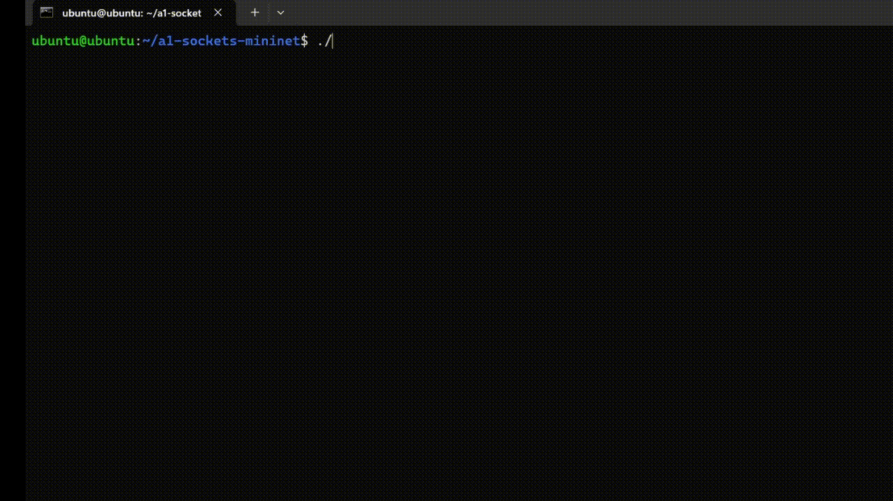
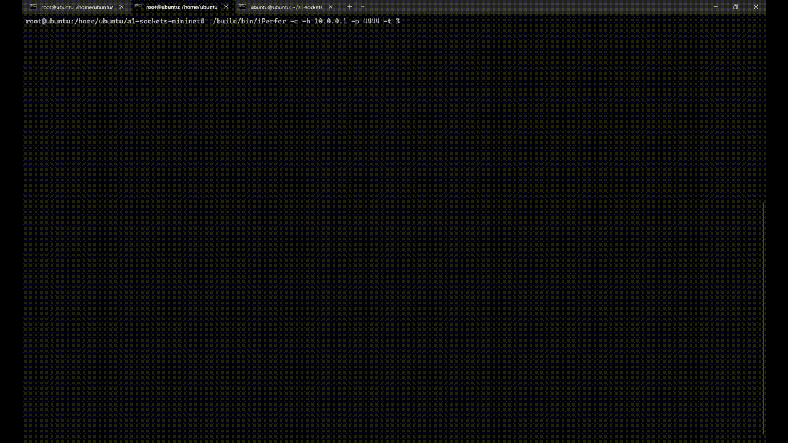
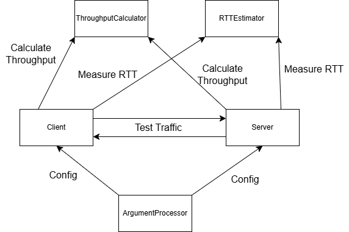

# 🚀 iPerfer 🌐

> *A fast, lightweight network performance testing tool inspired by iPerf.*

---

## 📖 Table of Contents
- [About](#about)
- [Quickstart](#quickstart)
- [Features](#features)
- [Architecture](#architecture)
- [Usage Examples](#usage-examples)
- [FAQ](#faq)
- [Contributing](#contributing)
- [License](#license)

---

## 📝 About
iPerfer is a clone of the popular iPerf tool, built for measuring network throughput and latency.
It is designed for students, developers, and network engineers who want a simple way to test TCP performance.

**Why it exists:**
To provide an educational, open-source implementation of iPerf that’s easy to modify and extend.

[## 🎬 Demo GIFs]

**Server Side Demo:**


**Client Side Demo:**


## ⚡ Quickstart

### Installation
```bash
git clone https://github.com/bjclifton/iPerfer.git
cd iPerfer
make
```

### Running the Server
```bash
./build/bin/iPerfer -s -p 4444
```

### Running the Client
```bash
./build/bin/iPerfer -c -h <server_ip> -p 4444 -t 10
```

> 🖼️ *GIF Placeholder:* Insert a GIF of starting the server and client here.

---

## 🌟 Features
- Lightweight, fast TCP throughput testing.
- Server and client modes.
- Real-time stats with clean logging (spdlog).
- Configurable test duration and port.

> 🖼️ *GIF Placeholder:* Insert a GIF showing real-time stats during a test.

---

## 🏗️ Architecture
Below is the high-level architecture of iPerfer:



- **Client** sends data packets at a specified rate.
- **Server** ACKs each packet and logs received data.
- **RTT Estimator** calculates latency.

---

## 💻 Usage Examples
```bash
# Run server on port 5555
./build/bin/iPerfer -s -p 5555

# Run client for 15 seconds to server at 192.168.1.10
./build/bin/iPerfer -c 192.168.1.10 -p 5555 -t 15
```


Output:
```
[info] Received=10240 KB, Rate=8.19 Mbps, RTT=20 ms
```

---

## ❓ FAQ

**Q: How is iPerfer different from iPerf?**
A: It’s a simplified reimplementation for learning purposes.

**Q: Can I use it in production?**
A: Sure, but it’s mainly educational.

**Q: What platforms are supported?**
A: Linux and other Unix-like systems.

---

## 🤝 Contributing
Pull requests are welcome! For major changes, please open an issue first to discuss what you would like to change.

---